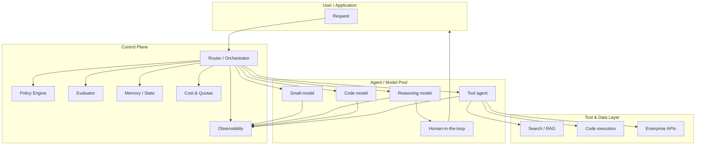

# From Agent Swarms to Agent Control Planes

> A builder's guide to the emerging infrastructure layer that routes models, tools, memory, evaluators, policies, and execution environments.

## Introduction

Agent building is changing. For the last few years, the dominant way to ship an agent was to hand-write a workflow: a chain of calls, a few prompt templates, some tool definitions, and hope the model behaves at runtime. That approach still works for narrow demos, but it does not scale. Teams are now asking the same infrastructure questions about every agent: Which model should answer this request? What happens when that model is down? Who checks the output? Where is the audit trail? How much did this cost?

The answer appearing in research, open-source tooling, and enterprise marketing is the *agent control plane*: a governed layer that sits between users and a pool of agents, models, tools, and policies, and decides at runtime how a request is handled. This article traces the lineage behind that idea—from Mixture-of-Experts and cost-aware cascades to test-time search, tool use, ensembling, learned orchestrators, and production gateways—and explains what a control plane actually does, why it matters, and where the engineering is still uncertain.

The claim is not that control planes are a finished product category. They are a shift in where control lives. Instead of hard-coding orchestration into every agent, teams are moving toward a shared layer that routes, observes, and governs. That shift has real consequences for builders, and it also has real gaps.

## Why this matters now

Three pressures are converging.

**First, model choice is no longer a one-time decision.** A single product may use a cheap model for classification, a mid-size model for drafting, a reasoning model for hard problems, and a code model for execution. Picking one model per task by hand does not work when tasks overlap, models improve every quarter, and pricing changes with them.

**Second, agent failures are operational failures.** A bad answer in a chatbot is embarrassing; a bad tool call in an agent that can read a database or send email is an incident. Teams need fallbacks, guardrails, human handoffs, and audit logs. Those concerns belong to infrastructure, not to each agent's prompt.

**Third, the surface area of agent systems is expanding.** Memory, evaluators, multi-agent debate, tool use, code execution, and policy enforcement are no longer research curiosities. They are parts of a production system. Without a control layer, the result is a tangle of hand-written workflows that are hard to test, harder to secure, and nearly impossible to reason about.

A control plane does not solve all of this. But it gives teams a place to put the cross-cutting concerns: routing, fallback, policy, memory, evaluation, observability, cost, and lifecycle governance.

## Part I — Lineage: eight tributaries

The control-plane idea did not arrive from nowhere. It grew out of several research and engineering threads that are now merging.

### 1. Conditional computation: routing inside the model

Mixture-of-Experts (MoE) is the earliest ancestor. Shazeer et al. (2017) introduced a sparsely-gated MoE layer that routed each token to a small subset of thousands of feed-forward experts. Fedus et al. (2021) simplified this with Switch Transformers, using a single expert per token and showing large pre-training speedups. The lesson is old: not every part of a problem needs the same compute. Modern agent routing applies the same intuition across models, tools, and agents instead of across neural experts.

### 2. Cost-aware cascades: which model for which query?

Dohan et al. (2022) framed chain-of-thought, verifiers, and tool use as probabilistic programs composed from language models. Chen et al. (2023) pushed this further with FrugalGPT, learning which model combination to call for each query and reporting large cost reductions. Ong et al. (2024) showed that routers trained on preference data can transfer to new model pools, and Hu et al. (RouterBench, 2024) provided a benchmark for comparing them. The engineering takeaway is clear: a learned router can often match a strong model's accuracy at a fraction of the cost.

### 3. Reasoning-time search: thinking harder at test time

Wang et al. (2022) showed that self-consistency—sampling multiple reasoning paths and voting—improves chain-of-thought reasoning. Yao et al. (2023) generalized this to Tree of Thoughts, where an explicit search tree lets the model backtrack. Shinn et al. (2023) added linguistic feedback and episodic memory in Reflexion, and Du et al. (2023) showed that multi-agent debate can improve factual accuracy. These strategies expand the space of what can happen at inference time. A control plane is the natural place to decide when to spend extra compute on search, reflection, or debate.

### 4. Tool use as scaffold

Yao et al. (2022) introduced ReAct, interleaving reasoning traces with tool actions. The pattern is now everywhere: an agent thinks, acts, observes, and repeats. But tool use also multiplies risk. A control plane can decide which tools an agent may call, under what conditions, and with what approval policy.

### 5. Model ensembling and fusion

LLM-Blender (Jiang et al., 2023) ranks and fuses outputs from multiple models. Mixture-of-Agents (Wang et al., 2024) layers agents so that each layer uses the previous layer's outputs as auxiliary context. OpenRouter Fusion exposes a commercial fused endpoint. Ensembling raises the same governance question as routing: who decides which outputs are combined, and on what basis?

### 6. Learned orchestration: from code to scaffold generators

The most recent signal is a class of systems that learn to generate agent workflows. Sakana Fugu (Tang et al., 2026) trains orchestrator models to understand a query and dynamically generate agent teams and scaffolds. Trinity (Xu et al., 2025) uses a small coordinator to assign Thinker, Worker, and Verifier roles. Conductor (Nielsen et al., 2025) uses reinforcement learning to design communication topologies among agents. These systems do not replace human design, but they move it up a level: from writing every step to specifying objectives and constraints and letting the orchestrator propose a workflow.

This is where caution is needed. Fugu's reported results on SWE-Bench Pro, Terminal Bench, LiveCodeBench, GPQA-Diamond, Humanity's Last Exam, and CharXiv Reasoning are eye-catching, but the paper is very recent and not yet independently reproduced. Benchmarks evolve, and high scores can reflect task leakage or cherry-picking. Fugu is a signal, not a settled fact.

### 7. Automated workflow design: search over topologies

AFlow (Zhang et al., 2024) uses Monte Carlo Tree Search over code-represented workflows. Hu et al. (Meta Agent Search, 2024) proposed an automated method to discover novel agent designs across domains. MASRouter (Yue et al., 2025) and AgentPrune (Li et al., 2024) optimize routing and communication graphs to cut cost while preserving performance. The common thread is that the workflow itself becomes an optimization target.

### 8. Runtime frameworks and production gateways

The implementation layer is already crowded. LangGraph, AutoGen, CrewAI, LlamaIndex Workflows, Haystack, OpenAI Agents SDK, and DSPy provide reusable primitives for building agents. Gateways such as LiteLLM, OpenRouter, Portkey, Kong, and Cloudflare AI Gateway add unified APIs, routing, fallback, caching, rate limiting, and spend tracking. Observability tools such as LangSmith, Arize Phoenix, Langfuse, and Helicone provide tracing, evaluation, and cost attribution. Enterprise platforms such as Microsoft Copilot Studio, Salesforce Agentforce, and ServiceNow AI Agents wrap these capabilities in low-code interfaces and governance consoles.

These tools are not all "control planes" in the same sense. Some are thin routers; some are thick frameworks; some are enterprise control towers. That ambiguity matters, and it is why the term needs a concrete definition.

## Part II — What a control plane actually does

A useful working definition: an agent control plane is a runtime layer that makes cross-cutting decisions about how user requests are handled across a heterogeneous pool of models, tools, agents, policies, and memory systems.

The capabilities that define it can be grouped into seven areas:

| Capability | What it means in practice |
|---|---|
| **Routing** | Choose a model, agent, tool chain, or reasoning strategy for each request. |
| **Fallback** | Retry, switch models, or escalate when a call fails or violates policy. |
| **Policy / guardrails** | Enforce limits on outputs, tool calls, data access, and escalation. |
| **Memory / state** | Maintain context across turns, sessions, and agents without leaking between tenants. |
| **Evaluation** | Score outputs, detect hallucinations, and decide when to rerun or escalate. |
| **Observability** | Produce traces, cost attribution, audit logs, and latency metrics. |
| **Lifecycle governance** | Manage versions, deployments, approvals, and human-in-the-loop workflows. |

Not every product with "control plane" in its marketing covers all seven. In practice, three patterns dominate:

- **Thin gateway.** A routing and policy proxy, such as LiteLLM or OpenRouter. It unifies APIs, handles fallbacks, and tracks spend. It does not know much about the agent's internal reasoning.
- **Thick framework.** A runtime such as LangGraph or AutoGen. It owns state, handoffs, and tool orchestration, but usually within a single codebase.
- **Enterprise control tower.** A platform such as Salesforce Agentforce or ServiceNow AI Agents. It adds governance consoles, connectors, approval workflows, and tenant isolation, often at the cost of flexibility.

A mature team will likely use more than one. The control plane is an architectural layer, not a single vendor product.

## Part III — From agent swarms to governed planes

Hand-written agent workflows fail at scale for the same reason hand-written RPC routing failed at scale: every team reinvents the same cross-cutting logic, and no one can reason about the whole system. The symptoms are familiar:

- Prompt drift. Each agent has its own way of handling errors, retries, and tool failures.
- Shadow routing. A "quick fix" sends a request to a different model in one agent but not another.
- Blind spots. No one knows the total cost, latency distribution, or failure rate across agents.
- Policy gaps. Guardrails are implemented inconsistently, or not at all, in non-obvious execution paths.

Moving orchestration into a control plane does not eliminate these problems, but it centralizes them. A builder can write an agent that declares what it needs—tools, models, approval thresholds, cost budgets—and let the control plane resolve the rest.

Learned orchestrators such as Fugu, Trinity, and Conductor take this further. Instead of a human writing the scaffold, a smaller model generates or selects it. This is a meaningful change in abstraction, but it is also a new dependency. The orchestrator itself has latency, cost, failure modes, and training-data biases. Teams should treat it as infrastructure, not magic.

## System structure: a reference architecture

The diagram below is a simplified reference architecture, not a product recommendation. It shows where a control plane sits and what it touches.

In this architecture, the control plane is not one box; it is the set of responsibilities that connect the user to the pool of capabilities. The router may be a learned model, a rule-based cascade, or a hybrid. The policy engine enforces hard constraints. Evaluators decide whether an answer is good enough. Memory and observability make the system inspectable. Cost and quotas prevent runaway spend.

## Part IV — Limits, cautions, and open problems

The shift toward control planes is real, but it is not without risks.

**Very recent research is unproven.** Fugu, Trinity, and Conductor are preprints or very recent papers. Their benchmarks are impressive but not independently reproduced. Treat them as signals of where the field is heading, not as production-ready recipes.

**"Control plane" is a marketing term.** Salesforce, ServiceNow, Microsoft, and infrastructure vendors use it differently. Some mean model routing; some mean agent lifecycle management; some mean enterprise governance. The article defines it explicitly, but readers should map vendor claims to concrete capabilities.

**Benchmarks are directional, not definitive.** SWE-Bench, Humanity's Last Exam, and similar leaderboards evolve. High scores may reflect leakage, overfitting, or task-specific tuning. Do not choose an architecture based on a leaderboard alone.

**The orchestrator adds cost and latency.** A learned router or scaffold generator is itself a model call. End-to-end P99 latency and dollar-cost-per-task at production scale are under-reported. Benchmark your own workloads.

**Governance and accountability are under-specified.** When a control plane routes a request through a chain of models, tools, and policies, tracing liability, explainability, and consent is hard. There is no widely accepted standard for this yet.

**Multi-tenancy is an engineering gap.** Most research and open-source tooling focuses on a single user or task. Scheduling, isolation, and billing across tenants or teams are still mostly vendor-specific.

**Protocol competition is unresolved.** MCP, A2A, ACP, and ANP are competing interoperability protocols. Their relationship to control-plane governance is still emerging.

## Practical takeaway: a builder checklist

If you are building or refactoring an agent system, consider these questions:

- [ ] Have you separated *what the agent tries to do* from *how the request is routed, retried, and observed*?
- [ ] Can you swap the model for a given task without changing the agent's code?
- [ ] Do you have fallback rules for model outages, rate limits, and policy violations?
- [ ] Are guardrails enforced in one place, or scattered across prompts and tool wrappers?
- [ ] Can you trace the full path of a request, including cost, latency, and model/tool calls?
- [ ] Do you have evaluators that can reject or escalate an output before it reaches the user?
- [ ] Is memory scoped correctly across users, sessions, and agents?
- [ ] Have you set cost or token quotas, and do you alert when they are approached?
- [ ] Are human-in-the-loop rules defined for high-stakes tool calls or uncertain outputs?
- [ ] Have you benchmarked routing overhead on your own traffic, rather than trusting vendor claims?

If you cannot answer yes to most of these, a control plane is likely the next architectural investment worth considering.

## Conclusion: a shift, not a product

Agent orchestration is moving from hand-written workflows toward governed control planes. That shift has deep roots in conditional computation, cost-aware routing, test-time search, tool use, ensembling, and learned orchestration. It is also being accelerated by a crowded landscape of frameworks, gateways, observability tools, and enterprise platforms.

The term "control plane" is contested, the vendors are noisy, and the research is moving fast. But the underlying idea is durable: teams need a shared layer that routes, observes, and governs agent behavior. The builders who benefit first will be the ones who treat that layer as infrastructure—defined by capabilities, not by product names—and who stay skeptical of both hype and premature standardization.

## Sources

- Shazeer et al., "Outrageously Large Neural Networks: The Sparsely-Gated Mixture-of-Experts Layer." https://arxiv.org/abs/1701.06538
- Fedus et al., "Switch Transformers: Scaling to Trillion Parameter Models with Simple and Efficient Sparsity." https://arxiv.org/abs/2101.03961
- Dohan et al., "Language Model Cascades." https://arxiv.org/abs/2207.10342
- Chen et al., "FrugalGPT: How to Use Large Language Models While Reducing Cost and Improving Performance." https://arxiv.org/abs/2305.05176
- Ong et al., "RouteLLM: Learning to Route LLMs with Preference Data." https://arxiv.org/abs/2406.18665
- Yao et al., "Tree of Thoughts: Deliberate Problem Solving with Large Language Models." https://arxiv.org/abs/2305.10601
- Yao et al., "ReAct: Synergizing Reasoning and Acting in Language Models." https://arxiv.org/abs/2210.03629
- Wang et al., "Mixture-of-Agents Enhances Large Language Model Capabilities." https://arxiv.org/abs/2406.04692
- Tang et al., "Sakana Fugu: Orchestrator Models for Adaptive Agentic Scaffolds." https://arxiv.org/abs/2606.21228
- Zhang et al., "AFlow: Automating Agentic Workflow Generation." https://arxiv.org/abs/2410.10762
- LiteLLM documentation. https://docs.litellm.ai/
- LangGraph documentation (LangChain). https://www.langchain.com/langgraph
- Wang et al., "Self-Consistency Improves Chain of Thought Reasoning in Language Models." https://arxiv.org/abs/2203.11171
- Shinn et al., "Reflexion: Self-Reflective Agents with Dynamic Memory." https://arxiv.org/abs/2303.11366
- Du et al., "Improving Factuality and Reasoning in Language Models through Multiagent Debate." https://arxiv.org/abs/2305.14325
- Jiang et al., "LLM-Blender: Ensembling Large Language Models with Pairwise Ranking and Generative Fusion." https://arxiv.org/abs/2306.02561
- Xu et al., "Trinity: Harmonizing Multiple Large Language Models as a Single Mind." https://arxiv.org/abs/2512.04695
- Nielsen et al., "Conductor: Learning to Orchestrate LLM Agents via Reinforcement Learning." https://arxiv.org/abs/2512.04388
- Hu et al., "RouterBench: A Benchmark for Multi-LLM Routing." https://arxiv.org/abs/2403.12031
- Hu et al., "Automated Design of Agentic Systems." https://arxiv.org/abs/2408.08435
- Yue et al., "MASRouter: A Multiplexing LLM Agent Router." https://arxiv.org/abs/2502.11133
- Li et al., "AgentPrune: Reducing Communication Redundancy in Multi-Agent Systems." https://arxiv.org/abs/2410.02506
