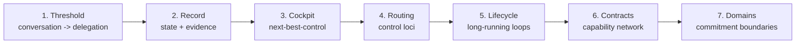

# AI Delegation Orchestration: From Conversation to Durable Agent Work

## Summary

AI interfaces can remain conversational, but consequential AI work should not be governed by chat transcripts alone. Voice, text, chat, and UI commands are still natural ways for humans to express intent. The missing work primitive is a bounded delegation; the missing system-of-record artifact is a delegation record.

This package is now structured as a seven-part article series. The goal is not to trim useful material out of one essay, but to redistribute it into a reading path where each article answers one question.

## Core Thesis

Conversation should be the interface for intent capture, clarification, and review. Delegation should be the work primitive. Delegation records, operator cockpits, control loci, long-running loops, capability networks, and domain-specific review boundaries should govern consequential AI work.

## Primary Reader

Builders, researchers, students, advanced AI users, and operators of multi-agent or long-running AI workflows who are starting to feel the limits of chat-session-based work.

The series should also be useful to non-developers because the same pattern appears in research, legal review, education, business operations, policy work, finance, and government.

## Reader Pathways

- **Conceptual path:** plain-language framing, analogies, diagrams, and domain examples.
- **Technical path:** schema fields, control routing, runtime state, review surfaces, telemetry, and governance cautions.

The articles should let non-technical readers understand the shape of the problem while giving technical readers enough structure to implement or critique systems.

## Article Series

### 1. From Conversation to Delegation

Natural language remains the interface; delegation becomes the durable work primitive.

Path: [articles/01-from-conversation-to-delegation](./articles/01-from-conversation-to-delegation/README.md)

### 2. The Delegation Record

A schema for consequential AI work: objective, scope, non-goals, control boundary, evidence, freshness, risk, review, rollback, and exit condition.

Path: [articles/02-the-delegation-record](./articles/02-the-delegation-record/README.md)

### 3. The Operator Cockpit Problem

Why traces, summaries, and dashboards are not enough. The missing layer is next-best-control across active delegations.

Path: [articles/03-the-operator-cockpit-problem](./articles/03-the-operator-cockpit-problem/README.md)

### 4. Control Loci, Not Human Managers

An agent-native routing model: executor, verifier, arbiter, policy engine, context-refresh capability, and human/principal review.

Path: [articles/04-control-loci-not-human-managers](./articles/04-control-loci-not-human-managers/README.md)

### 5. Long-Running Delegations

How agents can continue for hours without repeatedly interrupting humans, while preserving checkpoints, evidence, stop conditions, and recovery paths.

Path: [articles/05-long-running-delegations](./articles/05-long-running-delegations/README.md)

### 6. Capability Contracts for Agent Networks

How to organize replaceable capabilities with explicit contracts, telemetry, data boundaries, and substitution rules instead of copying human job titles or org charts.

Path: [articles/06-capability-contracts-for-agent-networks](./articles/06-capability-contracts-for-agent-networks/README.md)

### 7. Commitment Boundaries in High-Stakes Domains

Why high-stakes AI use is not binary, and how evidence, review, appeal, privacy, and accountability change by domain.

Path: [articles/07-commitment-boundaries-in-high-stakes-domains](./articles/07-commitment-boundaries-in-high-stakes-domains/README.md)

## Companion Artifacts

- [Season synthesis](./season-1/README.md)
- [Article map](./season-1/article-map.yaml)
- [Visual system](./season-1/visual-system.md)
- [Technical companion](./season-1/technical-companion.md)
- Internal research memo: `RESEARCH.md` is source scaffolding, not public article prose.

## Visual Strategy

The visuals should explain system structure, not decorate the series. Prefer Mermaid, SVG, or native site components because they are inspectable and editable. Use generated raster images only later for optional conceptual cover or explainer artwork.

## One-Screen Series Map

## Limits And Cautions

The series should not claim that chat is obsolete. Conversation remains valuable for exploration, ambiguity, clarification, and review.

It should not imply broad AI autonomy is ready. The defensible claim is about making delegated work inspectable, bounded, resumable, and governable.

It should not present any private orchestration system as the answer. Private implementation experience can inform the framing only after abstraction.

## Privacy

This package uses public sources and sanitized discussion synthesis only. Public examples are generic and should remain detached from private projects, proprietary code, internal URLs, personal workflow details, and raw organizational specifics.
