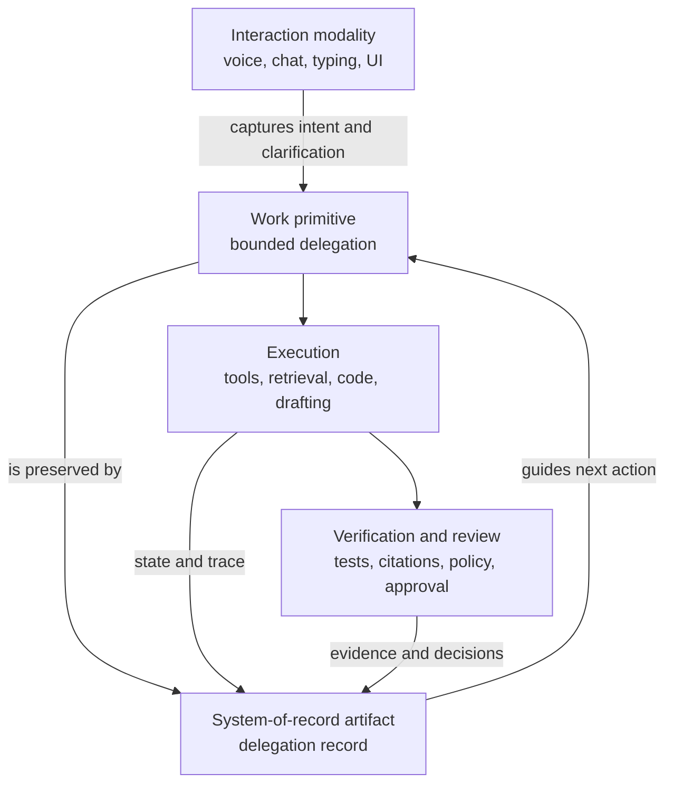
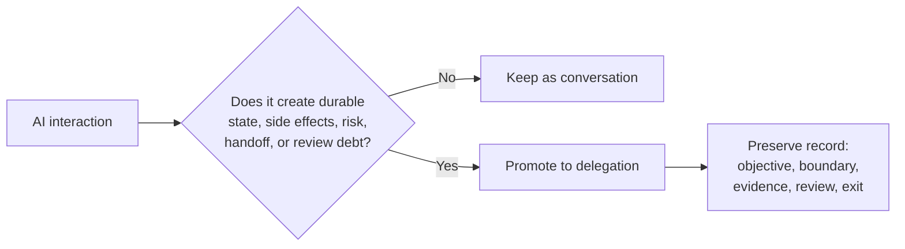

# From Conversation to Delegation: Why AI Work Needs a Durable Record

> Voice, typing, and chat can remain the human interface. They should not be the only place where consequential AI work lives.

## Thesis

Conversation can remain the interface for AI, but consequential AI work should be organized around bounded delegations rather than chat transcripts.

This is not an argument against chat. Natural language is still the easiest way for many people to express intent, clarify ambiguity, interrupt a run, and review a result. The mistake is treating the conversation as the durable unit of work. For small questions, that is fine. For multi-step, tool-using, long-running, high-stakes, or handoff-heavy work, the durable unit should be a delegation.

The core terms are simple:

- **Interaction modality:** how the user expresses or reviews intent, such as voice, chat, typing, a UI command, or a form.
- **Delegation:** a bounded assignment given to an agent, model, toolchain, or capability.
- **Delegation record:** the durable artifact that preserves objective, scope, state, evidence, risk, review, rollback, and exit condition.

## The Moment Chat Becomes Work

Most people first meet AI through a blank box: type something, get something back. That entry point is powerful because it removes ceremony. A non-programmer can describe a business process. A researcher can ask for a source map. A developer can ask an agent to fix a failing test. A lawyer can ask for a risk table. A teacher can ask for a lesson plan.

The problem appears when the interaction quietly becomes work.

The user asks for a small task. The agent asks clarifying questions, reads files, searches sources, calls tools, writes a draft, runs tests, changes a plan, and leaves behind a long transcript. Later, the user returns and has to reconstruct what happened: What was the original objective? What did the agent actually change? Which assumptions are still fresh? What evidence supports the result? What is still blocked? Is the next action retry, review, rollback, narrower delegation, or approval?

Developers feel this first because coding agents expose branches, diffs, tests, logs, pull requests, and tool approvals. But the pattern is broader. People using AI for consequential, multi-step, tool-using work in research, finance, education, legal review, operations, or policy will face the same transition. They do not simply need more transcript. They need clearer delegated state.

## Why This Is A Coordination Problem

Malone and Crowston describe coordination as managing dependencies among activities. Endsley's situation-awareness work separates perceiving state, understanding it, and projecting what may happen next. Gutwin and Greenberg's workspace-awareness framework shows why collaborators need visible cues about others' actions, intentions, and changes. Mark, Gudith, and Klocke show that interrupted knowledge work carries resumption cost.

Those sources were not written for AI agents, but they explain the shape of the problem. Once AI produces persistent work across time, tools, and collaborators, the operator needs durable coordination state. A chat transcript can record words. It is weak at preserving the current contract of work.

## Three Layers

The interaction modality should stay flexible. It can be voice, chat, typed prompt, command palette, or structured UI.

The work primitive should be explicit. If the system is doing work, the work should have a name, boundary, and exit condition.

The record should be durable. It should survive interruption, handoff, review, and audit.

## When Chat Should Stay Chat

Not every AI interaction needs a delegation record. Many should remain lightweight:

- asking for a definition
- brainstorming names
- rewriting a paragraph
- translating a short message
- exploring an idea with no commitment
- generating disposable examples
- asking what an error message roughly means

The promotion threshold is consequence. If the work has state, side effects, private inputs, multiple steps, handoff, cost, evidence requirements, or future review obligations, it is a candidate for delegation.

## Three Quick Examples

In coding, "fix the failing checkout test" becomes a delegation with scope, non-goals, files touched, commands run, tests, risks, and review status.

In research, "find support for this claim" becomes a delegation with source quality, counterarguments, confidence, freshness, and publication readiness.

In legal review, "review this vendor contract for risky clauses" becomes a delegation with clause categories, source references, risk rubric, exclusions, no-external-send boundary, and human review requirement.

The interface can be the same sentence in a chat box. The durable work object should not be the same transcript.

## Practical Takeaway

Before letting an AI interaction become real work, ask:

1. What exactly has been delegated?
2. What is outside the boundary?
3. What evidence will prove the result?
4. What should happen if the agent gets stuck or drifts?
5. What condition ends the delegation?

If those answers live only in chat, the system is relying on human memory and post-hoc reconstruction.

## Claim Support

| Claim | Source support | Confidence | Caveat |
|---|---|---|---|
| AI work becomes a coordination problem once agents act across tasks, tools, and time. | Malone and Crowston on coordination as dependency management. | Medium | The source predates AI agents; this is an application of coordination theory. |
| Operators need visible durable state, not only conversation. | Endsley on situation awareness; Gutwin and Greenberg on workspace awareness. | Medium | These sources support the awareness need, not a specific delegation schema. |
| Interruption makes resumption costly. | Mark, Gudith, and Klocke on interrupted work. | Medium | The exact cost depends on task and environment. |
| Chat should remain useful for intent and clarification. | Scenario analysis and current AI interface practice. | Medium | This is a design stance, not an empirical benchmark claim. |

## Bridge To Article 2

Delegation is the work primitive. The next question is practical: what should the delegation record contain?

## Sources

- Malone and Crowston, "The Interdisciplinary Study of Coordination." https://crowston.syr.edu/sites/default/files/acmcs94.pdf
- Endsley, "Toward a Theory of Situation Awareness in Dynamic Systems." https://journals.sagepub.com/doi/10.1518/001872095779049543
- Gutwin and Greenberg, "A Descriptive Framework of Workspace Awareness for Real-Time Groupware." https://link.springer.com/article/10.1023/A%3A1021271517844
- Mark, Gudith, and Klocke, "The Cost of Interrupted Work." https://www.ics.uci.edu/~gmark/chi08-mark.pdf

## Agent Involvement

This draft was prepared with AI assistance from a sanitized research discussion and public sources. Human editorial review is required before public publication.
