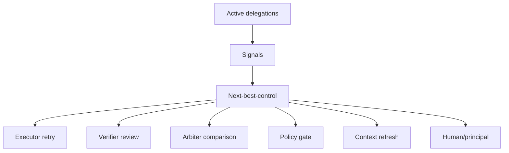

# The Operator Cockpit Problem: Why More Traces Are Not Enough

## Thesis

The operator problem is not lack of information; it is lack of control routing across many active delegations.

Agent systems already produce traces, logs, chat transcripts, summaries, tool calls, test outputs, and cost metrics. Those are useful, but they do not answer the operator's central question:

> Where should control go next?

## The Human Becomes The Bottleneck

The first pain of parallel AI work is context loss. The second is review debt. The third is unnecessary interruption.

Imagine one operator supervising several delegations:

- a coding agent fixing a checkout test
- a research agent mapping sources
- a writing agent drafting an article
- a data agent validating a spreadsheet
- a policy agent checking privacy constraints

Each agent can produce output faster than the operator can inspect it. If every uncertainty routes to the human, the system becomes slower as it becomes more capable. The human turns into an approval queue.

The answer is not to hide more information inside summaries. The answer is to route control.

## A Cockpit Is Not A Log Viewer

A log viewer answers: what happened?

A trace viewer answers: how did the run unfold?

A dashboard answers: what is active?

An operator cockpit should answer: what needs control now, and where should that control go?

This cockpit can be a UI, queue, command center, terminal view, issue board, or agent-managed state layer. The form matters less than the function: it must reduce operator uncertainty.

## Operator Signals

| Signal | What it detects | Typical route |
|---|---|---|
| Blocked-on-input | A run is paused for a question or approval. | Policy or arbiter first; human only if boundary changes. |
| Review debt | Output exists but has not been inspected. | Verifier summarizes and checks evidence. |
| Drift risk | Work diverges from objective, scope, or non-goals. | Verifier flags exact drift; arbiter decides continue, split, or stop. |
| Stale context | Files, memory, sources, or assumptions may be outdated. | Context-refresh capability. |
| Side-effect exposure | Agent touched external or irreversible systems. | Policy gate and human/process review. |
| Confidence gap | Evidence is weak, missing, or contradictory. | Agent gathers evidence or downgrades claim. |
| Recombination pressure | Parallel delegations overlap or conflict. | Arbiter compares and recommends merge, split, or kill. |
| Cost burn | Tokens, time, retries, or tool calls rise without progress. | Budget policy or arbiter replanning. |
| Escalation quality | Agent asks trivial or poorly framed questions. | Verifier rewrites or resolves before human. |

The cockpit should not show all signals equally. It should rank delegations by control value.

## A Concrete Cockpit Row

| Delegation | State | Signal | Next-best-control | Why |
|---|---|---|---|---|
| Checkout test fix | Tests pass, diff ready | Review debt | Verifier review | Human does not need raw transcript first. |
| Source map | 12 sources found | Confidence gap | Research agent retry | Two claims lack strong sources. |
| Contract review | Risk table done | Commitment boundary | Human/legal review | Acceptability is institutional judgment. |
| Data cleanup | Running 80 minutes | Cost burn | Arbiter replan | No progress after repeated retries. |

This is different from a task list. A task list says what is open. A cockpit says what kind of control each open item needs.

## The Cockpit Should Reduce Human Reading

AI systems are fast at producing text. Humans are slow at reading it. A cockpit should not require humans to read every transcript before knowing where to look.

For example, the cockpit might show:

- "Verifier found no scope drift; ready for human code review."
- "Research claim 3 is weak; reroute to source search."
- "Agent requests permission to call an external API; policy requires human approval."
- "Two delegations modified the same file; arbiter should compare diffs."

This is not about removing humans. It is about using human attention where it has the highest value.

## The Hard Part: Scoring Control

Next-best-control is not a simple priority number. It depends on risk, reversibility, evidence, time, cost, privacy, domain consequence, and user intent.

Software can make this easier because tests, diffs, and rollback are relatively concrete. Research and legal work are harder because evidence is interpretive. Government, education, and finance add policy, fairness, privacy, and appeal requirements.

This means the cockpit should be configurable by domain. A high-confidence coding test pass and a high-confidence legal risk classification should not be treated as the same kind of confidence.

## Practical Takeaway

If you are building an agent system, do not ask only:

- Can I see the trace?
- Can I summarize the session?
- Can I resume the run?

Ask:

- Which delegation needs control next?
- What signal triggered that need?
- Which control locus should handle it?
- What evidence is enough to move forward?
- When should the human be interrupted?

## Claim Support

| Claim | Source support | Confidence | Caveat |
|---|---|---|---|
| Operator awareness requires perceiving state, understanding it, and projecting next action. | Endsley on situation awareness. | Medium | The cockpit model is an application, not directly studied in this form. |
| Collaborative work benefits from visible awareness cues. | Gutwin and Greenberg on workspace awareness. | Medium | Agent work is not identical to human groupware. |
| Tracing is useful but not the same as control routing. | OpenAI Agents SDK tracing; LangGraph docs. | Medium | Tooling may add stronger routing surfaces over time. |
| Next-best-control is a design hypothesis. | Research memo scenario analysis. | Medium-low | Needs empirical evaluation in real operator workflows. |

## Bridge To Article 4

The cockpit identifies that control is needed. The next question is where that control should live. The answer is not always "the human."

## Sources

- Endsley, "Toward a Theory of Situation Awareness in Dynamic Systems." https://journals.sagepub.com/doi/10.1518/001872095779049543
- Gutwin and Greenberg, "A Descriptive Framework of Workspace Awareness for Real-Time Groupware." https://link.springer.com/article/10.1023/A%3A1021271517844
- OpenAI Agents SDK tracing. https://openai.github.io/openai-agents-python/tracing/
- LangGraph documentation. https://docs.langchain.com/oss/python/langgraph/overview

## Agent Involvement

This draft was prepared with AI assistance from a sanitized research discussion and public sources. Human editorial review is required before public publication.
