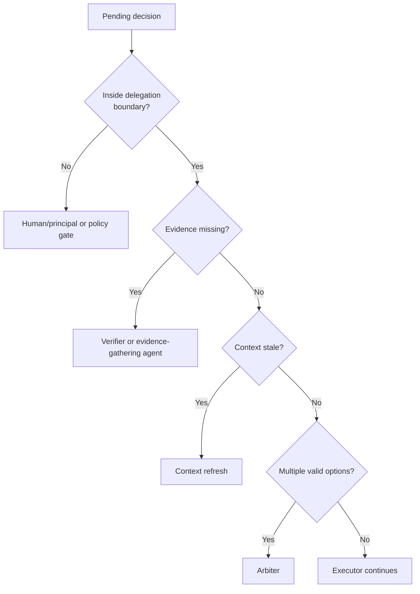

# Control Loci, Not Human Managers: An Agent-Native Routing Model

## Thesis

Agent systems should route decisions to the right control locus instead of copying human management structures or escalating every uncertainty to a person.

"Authority" is a human social term. It carries assumptions about employment, accountability, hierarchy, incentives, trust, and legal responsibility. Those assumptions do not map cleanly onto agent systems. An agent with a manager title does not become wiser because of the title. A "CEO agent" is not a CEO. A "senior reviewer agent" is not senior in the human sense.

The useful question is not who has the title. The useful question is where the next decision can be resolved.

## What Is A Control Locus?

A control locus is the place where a decision should be handled. In an agent-native system, common loci include:

| Control locus | Good for | Poor for |
|---|---|---|
| Executor agent | In-scope reversible work, retries, routine remediation. | Scope changes or conflicting valid goals. |
| Verifier agent | Independent checks, tests, source quality, drift detection. | Preference or institutional acceptance. |
| Arbiter agent | Comparing alternatives, resolving conflicts, selecting next tactic. | Final accountability decisions. |
| Policy engine | Fixed rules, permissions, budgets, forbidden actions. | Novel exceptions or value tradeoffs. |
| Context-refresh capability | Updating stale files, sources, memory, or plans. | Resolving business/legal preference. |
| Human/principal | Intent changes, irreversible commitments, high-consequence acceptance, preference judgments. | Routine retries and checks agents can handle. |

The principle:

> Delegate remediation. Escalate control-boundary changes.

## Why Human Escalation Is Often Too Early

Many agent systems interrupt the human because the agent lacks a better route. It asks:

- Should I retry?
- Which source should I trust?
- Can I change this file too?
- Do you want option A or B?
- Should I continue?

Some of those questions are legitimate. Many are not.

If the task is still within scope, reversible, and evidence can be gathered, the executor or verifier should often continue. If two valid approaches exist, an arbiter can compare them. If source context is stale, a context-refresh capability can reread. If a rule is fixed, policy can decide. The human should be interrupted when the delegation boundary changes, an irreversible commitment appears, or intent/preference/accountability cannot be inferred from the delegation.

## Routing Diagram

This diagram is intentionally simple. Real systems need domain policies, budget controls, privacy constraints, and confidence thresholds. But the routing idea is the same: do not treat the human as the default exception handler.

## Examples

In coding, an agent fixing a test should run tests again after a small reversible edit. It should not ask the human whether to retry the same test. It should ask if the fix requires changing authentication or database schema when those were out of scope.

In research, an agent that finds weak evidence should search again, downgrade the claim, or surface counterarguments. It should not ask the human to read every weak source. It should ask when the thesis itself must change.

In legal review, an agent can extract clauses and classify risk under a rubric. It should not decide acceptability or send a negotiation response. The commitment boundary belongs to a human or institutional process.

## Escalation-Boundary Matrix

| Situation | Default route | Human needed when |
|---|---|---|
| Test failed after scoped edit | Executor retry, then verifier. | The fix requires out-of-scope changes. |
| Source evidence is weak | Research agent gathers more evidence or downgrades claim. | The thesis or publication stance must change. |
| Two implementations both pass tests | Arbiter compares tradeoffs. | The tradeoff is product preference or risk tolerance. |
| Context may be stale | Context-refresh capability rereads sources/files. | The stale context changes the objective. |
| External send/deploy/file action requested | Policy gate. | The action creates irreversible or institutional commitment. |
| Budget exceeded without progress | Budget policy or arbiter replan. | More budget requires principal approval. |

## Why This Is Not Removing Humans

Human judgment remains central, but it becomes more precise. Humans are not used as universal parsers of agent uncertainty. They handle:

- intent changes
- preference tradeoffs
- institutional accountability
- irreversible external actions
- legal or financial acceptance
- ethical or policy exceptions
- final publication, deployment, or commitment

That is a higher-value role than approving every retry.

## The Risk Of Over-Automated Arbitration

An arbiter agent is not a neutral judge by default. It is another model or system with its own failure modes. It can prefer fluent explanations, miss hidden assumptions, or over-optimize for the wrong metric.

This means arbiter decisions should also be recorded. The system should preserve what alternatives were compared, what evidence was used, what criterion won, and whether the result changed the delegation boundary.

## Practical Takeaway

For every interruption, ask:

1. Is this inside the existing delegation boundary?
2. Can another agent gather evidence first?
3. Can policy decide from fixed rules?
4. Is this a preference or accountability decision?
5. Would human input change the objective, boundary, or commitment?

If not, the interruption is probably a routing failure.

## Claim Support

| Claim | Source support | Confidence | Caveat |
|---|---|---|---|
| Automation often changes human work rather than removing it. | Bainbridge, "Ironies of Automation." | Medium | Classic automation context, applied here to agent systems. |
| Trust and reliance require appropriate calibration. | Lee and See on trust in automation. | Medium | Does not prescribe this exact routing model. |
| Human-AI systems should support visibility, feedback, control, and appropriate handoff. | Amershi et al. guidelines; OpenAI HITL docs. | Medium | Guidelines are broad; implementation details vary. |
| Control loci are better than human-org titles for agent routing. | Synthesis from scenario tests and automation literature. | Medium-low | Needs practical evaluation. |

## Bridge To Article 5

Control loci make long-running delegations possible. Without them, every uncertainty breaks the run and waits for the human.

## Sources

- Bainbridge, "Ironies of Automation." https://ckrybus.com/static/papers/Bainbridge_1983_Automatica.pdf
- Lee and See, "Trust in Automation." https://journals.sagepub.com/doi/10.1518/hfes.46.1.50_30392
- Amershi et al., "Guidelines for Human-AI Interaction." https://www.microsoft.com/en-us/research/wp-content/uploads/2019/01/Guidelines-for-Human-AI-Interaction-camera-ready.pdf
- OpenAI Agents SDK human-in-the-loop documentation. https://openai.github.io/openai-agents-python/human_in_the_loop/

## Agent Involvement

This draft was prepared with AI assistance from a sanitized research discussion and public sources. Human editorial review is required before public publication.
