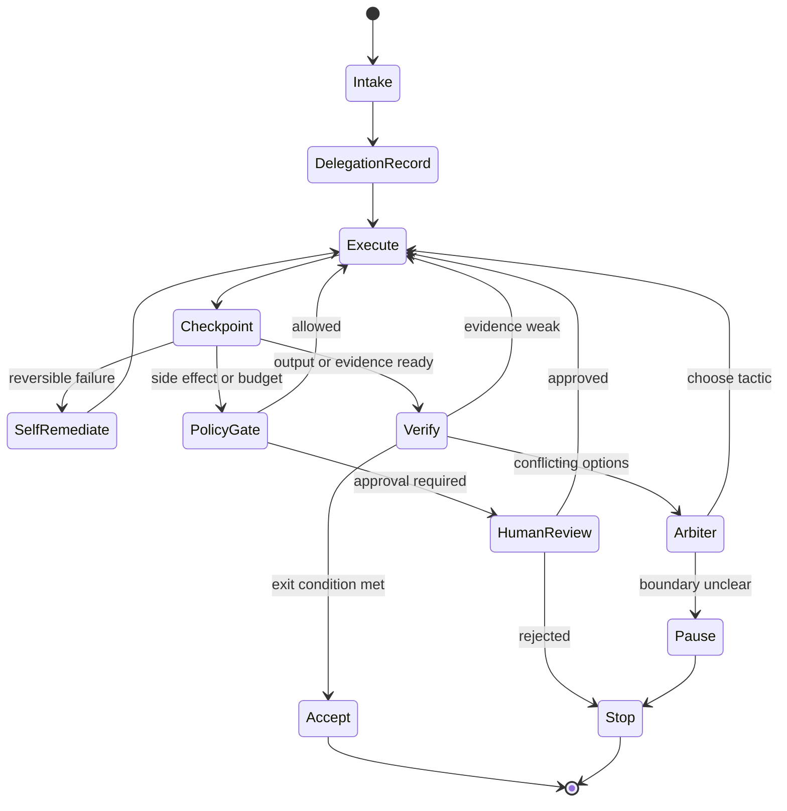
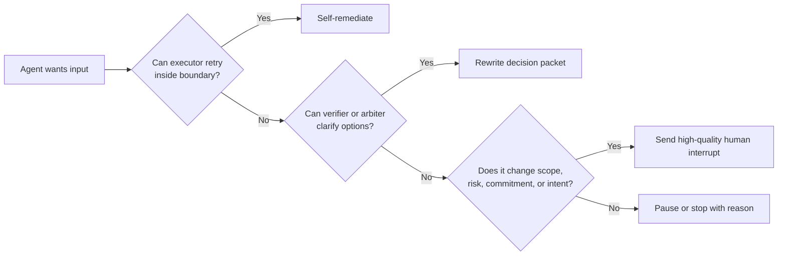

# Long-Running Delegations: How Agents Can Work for Hours Without Losing the Plot

## Thesis

Long-running AI work is viable only when the delegation has checkpoints, evidence gates, self-remediation loops, interruption rules, rollback paths, and explicit stop conditions.

Many agent workflows today still behave like extended conversations. The agent works for a while, asks the user something, waits, continues, drifts, summarizes, asks again, and eventually produces output that the user must reconstruct. This defeats the promise of delegation. If the human must keep returning to provide routine input, the system has not really delegated the work.

## Long-Running Does Not Mean Unbounded

A long-running delegation is not "let the agent do whatever it wants for hours." It is the opposite. It is a bounded assignment that can continue because the boundaries are explicit.

The agent needs to know:

- what outcome it is pursuing
- what is in scope
- what is forbidden
- what evidence is required
- when to retry
- when to ask another agent
- when to pause
- when to stop
- how to roll back or abandon

Without these, long-running autonomy becomes drift.

## Lifecycle

The key is that the human is not the only transition. Many failures route through self-remediation, verification, arbitration, context refresh, or policy first.

## Checkpoints

Checkpoints are not only saved state. They are meaning-bearing stops where the system can ask:

- Has the objective changed?
- Is the work still within scope?
- Is evidence strong enough?
- Are assumptions stale?
- Has cost risen without progress?
- Did the agent touch a commitment boundary?
- Is rollback still available?

A checkpoint should update the delegation record. If the record does not change, the checkpoint probably did not add control value.

## Interruption Quality

Long-running systems should measure whether interruptions are useful.

A high-quality interruption says:

- what decision is needed
- why the agent cannot resolve it
- what options exist
- what evidence supports each option
- what happens if the user does nothing
- whether the decision changes scope, risk, cost, or commitment

A low-quality interruption says:

- "Should I continue?"
- "What should I do next?"
- "Do you approve?"

Those questions may be acceptable in a prototype. At scale, they turn the human into the runtime.

## Reversible Systems Change The Boundary

The more reversible the environment, the more agents can safely do without interruption.

Coding has advantages: branches, tests, diffs, local execution, review, and revert. That makes many agent actions reversible. Legal, finance, education, and government often have weaker rollback. Sending an email, filing a document, approving a loan, changing a public record, or grading a student has social and institutional effects that cannot be treated like a branch revert.

Long-running delegation therefore depends on the domain's reversibility model.

## Budgets Are Stop Conditions

Time, tokens, money, retries, tool calls, and user patience are all budgets. A long-running delegation should not continue only because it can.

Budget rules can be simple:

- stop after three failed tactics
- pause if no evidence improves after a defined interval
- switch models only when expected value justifies cost
- ask an arbiter before expanding scope
- escalate if the rollback path is lost

Budget controls prevent "agent persistence" from becoming waste.

## Practical Takeaway

Before launching a long-running delegation, define:

1. checkpoint interval
2. self-remediation permissions
3. verifier criteria
4. arbiter criteria
5. policy gates
6. human interruption rules
7. rollback path
8. stop conditions

If these are absent, the agent is not long-running. It is merely unattended.

## Claim Support

| Claim | Source support | Confidence | Caveat |
|---|---|---|---|
| Durable execution and checkpoints are runtime concerns, not only model-intelligence concerns. | LangGraph docs; OpenAI HITL docs. | High | Specific implementation patterns differ by framework. |
| Human interrupts should carry enough context to support decision-making. | LangGraph HITL patterns; OpenAI HITL docs; human-AI interaction design principles. | Medium | "Interruption quality" needs stronger empirical measurement. |
| Start with simple workflows before complex agents. | Anthropic, "Building effective agents." | Medium | Guidance may not cover all enterprise orchestration needs. |
| Reversibility changes autonomy boundaries. | Scenario analysis and software workflow analogy. | Medium-low | Needs domain-specific evidence outside coding. |

## Bridge To Article 6

Long-running delegations require capabilities that can execute, verify, refresh context, enforce policy, and arbitrate. Those capabilities should form a network, but not a human-style org chart.

## Sources

- LangGraph documentation. https://docs.langchain.com/oss/python/langgraph/overview
- LangGraph human-in-the-loop documentation. https://docs.langchain.com/oss/python/langchain/human-in-the-loop
- OpenAI Agents SDK human-in-the-loop documentation. https://openai.github.io/openai-agents-python/human_in_the_loop/
- Anthropic, "Building effective agents." https://www.anthropic.com/research/building-effective-agents

## Agent Involvement

This draft was prepared with AI assistance from a sanitized research discussion and public sources. Human editorial review is required before public publication.
