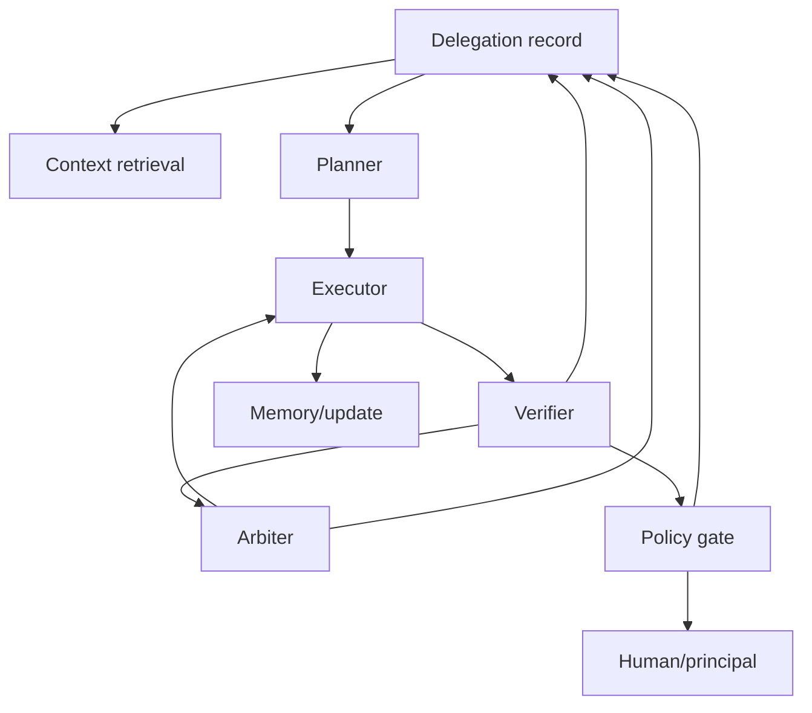

# Capability Contracts for Agent Networks

## Thesis

Agent systems should be organized around replaceable capabilities with explicit contracts, not around vague role prompts or artificial replicas of human organizations.

Human organizations contain useful coordination functions: planning, execution, review, escalation, policy, memory, specialization, and accountability. But copying the surface form of human organizations into AI systems often creates theater. A "manager agent" does not have human judgment. A "research intern agent" does not have employment incentives. A "legal department agent" does not carry professional liability.

The better move is to extract capabilities and give each capability a contract.

## What Is A Capability?

A capability is a bounded function the system can call under a contract.

Examples:

- retrieve relevant context
- inspect a codebase
- run tests
- summarize a document
- classify a clause
- verify citations
- compare alternative plans
- enforce a policy rule
- refresh stale context
- produce a review packet
- estimate risk
- route to a human

A capability may be implemented by a model, a tool, an agent workflow, a deterministic service, a human process, or a hybrid. The implementation can change as models improve. The contract should remain legible.

## Capability Contract

| Field | Question |
|---|---|
| Purpose | What does this capability do? |
| Inputs | What context or artifacts does it require? |
| Outputs | What does it produce? |
| Allowed tools | What can it access? |
| Data boundary | What can it read, write, store, or send? |
| Evidence | What proof does it attach? |
| Failure modes | How does it fail or signal uncertainty? |
| Escalation route | Where does unresolved control go? |
| Telemetry | What outcome data improves the capability? |
| Replaceability | How can another implementation substitute for it? |

This looks like engineering discipline because it is. Agent systems become harder to reason about when capabilities are hidden inside prompts or personality roles.

## Why Contracts Matter More Than Role Names

A role name says what a capability is supposed to be. A contract says how it can be trusted, replaced, audited, and constrained.

| Weak role prompt | Stronger capability contract |
|---|---|
| "Act as a senior reviewer." | Verify evidence against scope, cite failed checks, return confidence and unresolved risks. |
| "Be a project manager." | Compare active delegations, detect conflicts, propose next-best-control routes. |
| "Be a legal assistant." | Extract clauses, preserve references, apply rubric, avoid legal advice, require human review. |
| "Be a researcher." | Build claim map, rate source quality, surface counterarguments, mark freshness. |

This is also how the network stays replaceable. The implementation can shift from one model to another, or from a model to a deterministic tool, if the contract remains stable.

## Network, Not Org Chart

This graph is not an organization. It is a control network. Capabilities can be swapped, upgraded, or disabled. Some may be domain-specific. Some may become unnecessary as model intelligence improves. Some should remain separate because separation improves evidence, review, security, or accountability.

## Why Domain-Specific Capabilities Matter

A code verifier and a legal verifier are not the same capability.

Coding verification can inspect diffs, run tests, check types, and compare against scope. Legal verification may need clause references, jurisdiction awareness, confidentiality rules, and human counsel review. Research verification needs source quality, counterarguments, freshness, and claim strength.

The network should therefore support both generic protocols and domain-specific capabilities.

## Protocols Are Not Governance

Protocols and connectors make capabilities easier to call. Model Context Protocol and similar tool-connection patterns point toward a world where agents can access many tools and data sources through common interfaces.

That is useful, but interoperability is not governance. A protocol can say how to call a tool. It does not automatically decide whether the agent should call it, what data may be sent, what evidence must be retained, who reviews the result, or what happens when the tool output is wrong.

Capability networks need both connection and control.

## Telemetry Without Surveillance

Capabilities should improve from outcome data. A verifier should learn which checks caught real defects. A router should learn which escalations were useful. A context refresher should learn when stale context caused failures.

But telemetry can become surveillance or retention risk. Useful telemetry should be scoped to capability improvement, stripped of unnecessary private content, and governed by retention rules. The system should learn from outcomes without preserving every private interaction forever.

## Claim Support

| Claim | Source support | Confidence | Caveat |
|---|---|---|---|
| Workflows and agents should start simple and use explicit patterns where possible. | Anthropic, "Building effective agents." | Medium | This is a design guide, not a formal standard. |
| Tool/data interoperability does not itself solve security or governance. | Model Context Protocol introduction and security best practices. | Medium | MCP is one protocol family, not the whole ecosystem. |
| Cognition and coordination can be distributed across people, artifacts, and environment. | Hollan, Hutchins, and Kirsh on distributed cognition. | Medium | Analogy must not imply agents have human institutional responsibility. |

## Practical Takeaway

When designing an agent system, replace title questions with capability questions.

Instead of asking:

- Who is the manager agent?
- Who is the researcher agent?
- Who is the reviewer agent?

Ask:

- What capability is needed?
- What contract governs it?
- What evidence does it return?
- What control locus handles failure?
- Can another implementation replace it?
- What telemetry improves it safely?

## Bridge To Article 7

Capability contracts are only meaningful when they reflect domain risk. The same delegation pattern behaves differently in coding, legal, finance, government, education, and research.

## Sources

- Model Context Protocol introduction. https://modelcontextprotocol.io/docs/getting-started/intro
- Model Context Protocol security best practices. https://modelcontextprotocol.io/docs/tutorials/security/security_best_practices
- Anthropic, "Building effective agents." https://www.anthropic.com/research/building-effective-agents
- Hollan, Hutchins, and Kirsh, "Distributed Cognition." https://www.lri.fr/~mbl/Stanford/CS477/papers/DistributedCognition-TOCHI.pdf

## Agent Involvement

This draft was prepared with AI assistance from a sanitized research discussion and public sources. Human editorial review is required before public publication.
