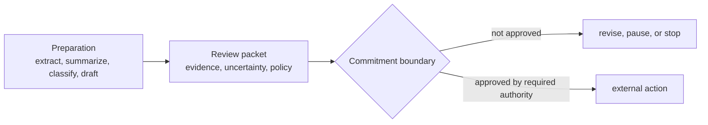

# Commitment Boundaries in High-Stakes Domains

## Thesis

High-stakes AI use should be designed around commitment boundaries: AI may help prepare work, but external, legal, financial, public, or rights-affecting actions need stricter evidence, review, appeal, privacy, and accountability controls.

Public discussion often collapses into two extreme positions. One says AI will replace everything. The other says AI is not good enough and should not be trusted. Both frames are too blunt. AI will affect many workflows, but the right question is not "replace or reject." The right question is what kind of delegation is safe, useful, reviewable, and accountable before and after a commitment boundary.

## The Same Pattern, Different Consequence

The delegation pattern travels across domains:

1. define objective
2. define scope and non-goals
3. define allowed actions
4. gather evidence
5. verify output
6. route unresolved control
7. stop, accept, or escalate

But the evidence and commitment boundaries change.

| Domain | Useful AI delegation | Strong boundary |
|---|---|---|
| Coding | Fix tests, inspect diffs, generate review packets. | Deployments, irreversible data changes, security-sensitive scope. |
| Research | Source maps, claim tables, counterarguments, freshness checks. | Publication claims, expert interpretation, citation integrity. |
| Legal | Clause extraction, risk tables, question drafting. | Legal advice, client confidentiality, negotiation commitments. |
| Finance | Reconciliation, anomaly detection, report drafting. | Loan decisions, fraud action, regulatory filing, customer impact. |
| Education | Lesson variants, feedback drafts, accessibility support. | Grading, discipline, student profiling, privacy-sensitive intervention. |
| Government | Case triage, document summarization, policy analysis. | Benefits denial, enforcement action, surveillance, appealable decisions. |

The framework does not say "AI yes" or "AI no." It says the delegation must match the domain's consequence.

## Evidence Is Domain-Specific

Coding evidence often looks like tests, diffs, type checks, logs, and rollback paths.

Research evidence looks like source quality, claim maps, counterarguments, quotation accuracy, methodology, and freshness.

Legal evidence looks like document references, clause text, jurisdictional context, risk rubric, uncertainty, and human review.

Education evidence may include curriculum alignment, learner context, accessibility needs, and teacher review.

Finance and government may require audit logs, explainability, policy compliance, impact assessment, and appealability.

This is why a generic confidence score is not enough. Confidence must be grounded in the evidence model of the domain.

## Human Oversight Is Not A Checkbox

Many policies invoke human oversight. The phrase can become empty if the human sees only a final answer and a vague confidence score.

Useful oversight requires:

- the delegation objective
- source inputs
- excluded actions
- evidence
- uncertainty
- decision history
- policy constraints
- impact on affected people
- options for correction or appeal

In high-stakes settings, the human reviewer should not be a rubber stamp placed at the end of an opaque system. The reviewer needs enough context to understand, challenge, reverse, or refuse the output.

## Commitment Boundaries

The most important line in high-stakes delegation is the commitment boundary.

Before the boundary, AI may help prepare:

- summarize
- classify
- extract
- compare
- draft
- detect anomalies
- produce review packets

After the boundary, the action affects the world:

- send a legal response
- approve or deny money
- publish a claim
- grade a student
- open an enforcement action
- change a public record
- deny a benefit

Those actions require stronger review, clearer accountability, and sometimes a human or institutional decision.

## Source-To-Obligation Matrix

The sources below do not create one universal rule. They come from different institutions, jurisdictions, and professional contexts. Their useful common lesson is narrower: consequential AI use needs documented boundaries and reviewable controls.

| Source | Relevant obligation pattern | Caveat |
|---|---|---|
| NIST AI RMF | Govern, map context, measure risk, manage controls. | Voluntary framework, not a domain-specific law. |
| EU AI Act | Risk management, data governance, technical documentation, logging, transparency, human oversight for high-risk systems. | Jurisdiction and applicability matter. |
| ABA Formal Opinion 512 | Competence, confidentiality, communication, supervision, and fee duties for lawyers using generative AI. | Applies to legal professional duties, not all domains. |
| UNESCO guidance | Human agency, privacy, inclusion, policy development, and appropriate educational/research use. | Guidance, not a single enforcement regime. |

This is enough to support the design claim, but not enough to claim that every domain should use the same process.

## Practical Takeaway

For high-stakes domains, do not start with "Can the model do this?" Start with:

1. What is the allowed delegation?
2. What action is forbidden?
3. What evidence is domain-valid?
4. Who reviews before commitment?
5. What does the affected person or institution need to challenge the result?
6. What data must not be retained?
7. What rollback, correction, or appeal path exists?

## Series Conclusion

The central argument of this series is not that AI work should become bureaucratic. It is that AI work should become explicit where consequence demands it.

Conversation remains valuable. Delegation makes work bounded. Records make it resumable. Cockpits route attention. Control loci reduce unnecessary human interruption. Long-running loops preserve state. Capability networks keep the architecture replaceable. Domain rules keep the system honest about consequence.

That is the direction: not chat-only AI, not unrestricted autonomy, and not human-org theater. Bounded delegation with durable control.

## Claim Support

| Claim | Source support | Confidence | Caveat |
|---|---|---|---|
| High-risk AI use needs documented governance and risk controls. | NIST AI RMF; EU AI Act. | High | Legal obligations depend on jurisdiction and system classification. |
| Legal AI use requires attention to competence, confidentiality, communication, and supervision. | ABA Formal Opinion 512. | High for U.S. lawyer ethics context | Not general legal advice and not global. |
| Education/research AI use needs privacy, human agency, inclusion, and policy boundaries. | UNESCO guidance. | Medium | Guidance is broad and context-sensitive. |
| Preparation and commitment should be separated in high-stakes workflows. | Synthesis from governance sources and delegation model. | Medium | Needs domain-specific validation. |

## Sources

- NIST AI Risk Management Framework. https://www.nist.gov/itl/ai-risk-management-framework
- EU AI Act. https://eur-lex.europa.eu/eli/reg/2024/1689/oj/eng
- American Bar Association, "Formal Opinion 512: Generative Artificial Intelligence Tools." https://www.americanbar.org/content/dam/aba/administrative/professional_responsibility/ethics-opinions/aba-formal-opinion-512.pdf
- UNESCO guidance on generative AI in education and research. https://www.unesco.org/en/articles/guidance-generative-ai-education-and-research

## Agent Involvement

This draft was prepared with AI assistance from a sanitized research discussion and public sources. Human editorial review is required before public publication.
