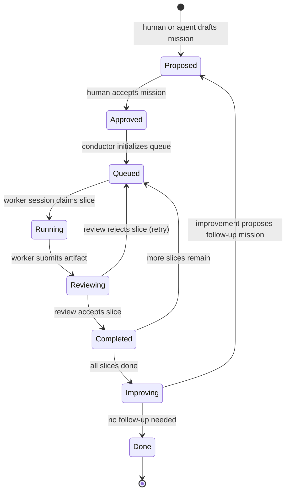

# Bounded Long-Running Project Conductor for Agent Teams

> A reference proposal for breaking multi-session, multi-agent software missions into bounded, dependency-ordered slices with durable state, explicit human handoffs, and a proposal-only self-improvement loop.

## Summary

Long agent-driven projects tend to collapse in three ways: a single agent tries to hold the whole plan in its context window, execution runs without checkpoints where a human would pause, and the reasoning behind decisions is lost when the session ends. This proposal describes a **bounded long-running project conductor**: a persistent, queue-based orchestrator that keeps the plan, state, and telemetry outside any one agent session, runs each slice in isolation, and routes execution evidence into a constrained self-improvement loop that can only *propose*, never *authorize*.

The conductor is intentionally bounded. It is not a general-purpose autonomous agent that can run forever; it is a scaffolding layer for a known mission with explicit start and end states, dependency ordering, per-slice authority limits, and mandatory human gates for promotion.

## Scope

In scope:

- Missions that take longer than one agent session (minutes to days).
- Missions that can be decomposed into a directed acyclic graph of slices, where each slice has a clear input artifact, output artifact, and acceptance test.
- Agent teams that execute slices in isolated branches or worktrees.
- Durable state (`state.json`) that survives session restarts and agent swaps.
- Append-only telemetry used for post-hoc review and *proposed* routing improvements.
- Human handoff points at slice start, slice completion, review gates, and mission promotion.

Out of scope:

- Open-ended, unbounded agent exploration without a defined mission end state.
- Real-time, low-latency coordination (the conductor is batch/queue oriented).
- Self-authorization of new goals, budget increases, or scope changes.
- Non-git backends such as issue trackers or cloud storage as primary state stores (extensions are possible, but the reference design uses git).

## Core concepts

| Term | Definition |
|---|---|
| **Mission** | A bounded, approved goal with a target artifact, success criteria, and an end state. |
| **Slice** | The smallest unit of delegated work: a clear input, a clear output, an acceptance test, and an authority envelope. |
| **Queue** | An ordered list of pending slices, persisted in `state.json`. |
| **Conductor** | The state machine that selects the next slice, spawns an isolated agent session, and records telemetry. |
| **Worker session** | A short-lived agent session that executes one slice and returns an artifact plus a completion report. |
| **Reviewer session** | A sibling-agent session that checks the worker output against the acceptance test and produces a review artifact. |
| **Improve step** | A proposal-only analysis of telemetry that may suggest queue reordering, slice refinement, or new slices. It cannot modify state without human approval. |

## Lifecycle states



State descriptions:

- **Proposed** — The mission description, success criteria, and initial slice sketch exist as a proposal. No execution has happened.
- **Approved** — A human has accepted the mission, assigned a budget, and set the authority envelope.
- **Queued** — The conductor has persisted the slice queue and is waiting for a worker to claim the next ready slice.
- **Running** — A worker session owns a slice and is executing it in an isolated branch or worktree.
- **Reviewing** — A reviewer session is checking the slice output against its acceptance test.
- **Completed** — A slice has passed review. Its artifact is merged into the mission branch.
- **Improving** — All slices are complete. Telemetry is analyzed and a *proposal* for the next mission or refinement is generated.
- **Done** — The mission is closed. Artifacts are promoted, telemetry is archived, and the queue is frozen.

## Safety boundaries

1. **Bounded scope.** Every mission has a written end state. The conductor refuses to add slices that are outside the approved scope unless a human approves a mission amendment.
2. **Isolated execution.** Each slice runs in its own branch or worktree. A worker session cannot see or modify artifacts from other in-flight slices.
3. **Authority envelope.** Each slice carries `allow_mutation`, `allowed_paths`, `token_budget`, and `approval_gate`. The conductor rejects any worker request that exceeds the envelope.
4. **No self-authorization.** The improve step may only create proposals. It cannot approve new budget, new slices, or promotion.
5. **Append-only telemetry.** Logs, review artifacts, and decision records are append-only. Nothing is deleted or rewritten.
6. **Human promotion.** Moving a completed mission artifact to the main branch or publishing it requires a human gate.
7. **Budget kill switch.** If cumulative cost or token usage exceeds the mission budget, the conductor stops and asks for human direction.

## Human handoff points

| Trigger | What the human decides |
|---|---|
| Mission proposed | Approve or reject the mission, scope, and budget. |
| Slice ready but high risk | Authorize or defer the slice; adjust allowed paths or budget. |
| Review rejects a slice | Whether to retry, refine the slice, or abort the mission. |
| Improve step proposes a follow-up | Approve as a new mission, fold into the current mission, or discard. |
| Mission completed | Promote artifacts, request additional review, or archive without promotion. |
| Budget or safety boundary hit | Provide more budget, reduce scope, or cancel. |

## Minimal schema

The following JSON schema is the smallest useful shape for a conductor mission record. Tooling can extend it, but anything calling itself a bounded conductor should be able to read and write this shape.

```json
{
  "mission_id": "uuid",
  "title": "string",
  "status": "proposed | approved | queued | running | reviewing | completed | improving | done",
  "success_criteria": ["string"],
  "budget": {
    "max_tokens": 0,
    "max_cost_usd": 0.0,
    "currency": "USD"
  },
  "slices": [
    {
      "slice_id": "uuid",
      "title": "string",
      "depends_on": ["slice_id"],
      "input_artifacts": ["path"],
      "output_artifacts": ["path"],
      "acceptance_test": "string",
      "authority": {
        "allow_mutation": true,
        "allowed_paths": ["src/"],
        "approval_gate": "human | auto",
        "max_tokens": 0
      },
      "status": "pending | running | review | completed | failed"
    }
  ],
  "telemetry": {
    "events": [
      {
        "timestamp": "ISO-8601",
        "event_type": "slice_started | slice_completed | review_passed | review_failed | improve_proposed | human_gate",
        "slice_id": "uuid | null",
        "agent_role": "worker | reviewer | conductor | human",
        "note": "string"
      }
    ]
  },
  "improvement_proposals": [
    {
      "proposal_id": "uuid",
      "triggered_by": ["event_id"],
      "description": "string",
      "requires_human_approval": true
    }
  ]
}
```

Slice-level `status` values (`pending | running | review | completed | failed`) are a subset of the full mission lifecycle. They describe the state of one slice inside a mission, not the mission as a whole.

## Relationship to other work

This proposal is the Aura Knowledge public-facing counterpart of internal work on long-running project orchestration. The concrete capability implementation, factory provenance, and retrospective live in the stibdedlom infrastructure repository and are referenced here only at a high level.

Related public ideas:

- Anthropic, "Building Effective Agents" — task decomposition and routing.
- LangGraph / LLMCompiler — graph-based, parallel orchestration.
- Temporal — durable execution and workflow state.
- Boyd's OODA loop — observe, orient, decide, act as the basis for the improve step.
- Capability-based modular AI — authority derived from capability identity, not prompt trust.
- AutoGen / CrewAI — contrast: chat-based coordination versus the artifact-based, queue-backed model here.

## Open questions

1. Should the conductor support non-git backends such as issue trackers or cloud object stores as primary state stores?
2. What is the right default granularity for a slice? Too small and overhead dominates; too large and context collapse returns.
3. How should nested conductors or recursive delegation report telemetry without losing the audit boundary?
4. Can learned routing optimize slice ordering without becoming an uninspectable black box?

## Practical takeaway

If a software mission cannot fit in one agent context window, do not ask one agent to hold the whole thing. Externalize the plan into a bounded queue, run each slice in isolation, review every output, and let a human approve promotion. The conductor is the scaffolding that makes that discipline repeatable.
